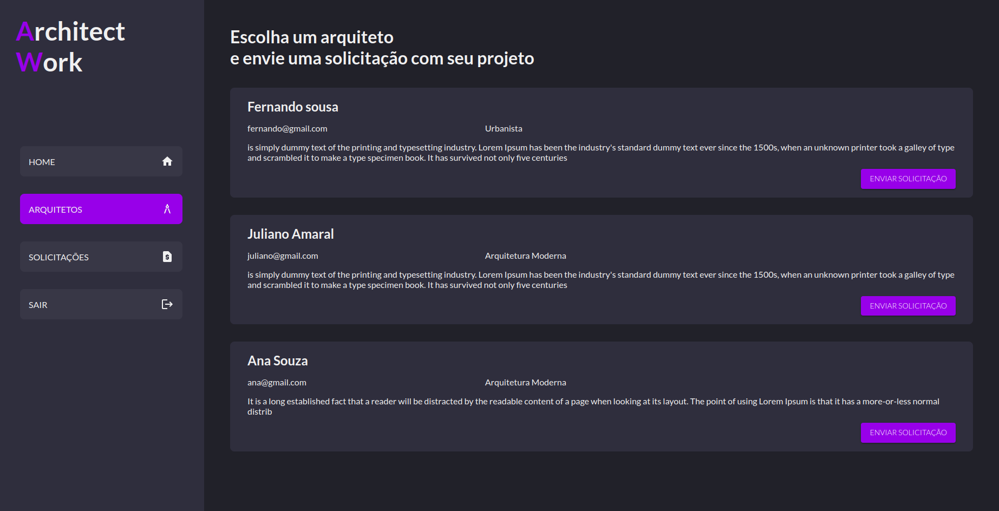
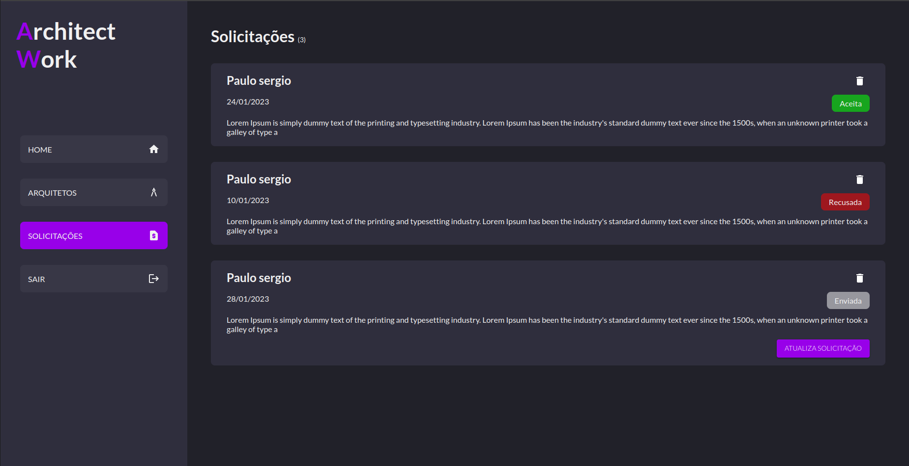

# Architect Work

  </img>
  
ARQUITETOS

  </img>
  
SOLICITAÇÕES

## Introdução:

A ideia do projeto é criar uma plataforma para arquitetos, aonde os clientes possam solicitar orçamentos de projetos de arquitetura, e os arquitetos possam visualizar as solicitações e responder se aceitam ou não o projeto.

### Funcionalidades:

- Cadastro de arquitetos
- Cadastro de clientes
- Cadastro de solicitações
- Edição/Eliminação de solicitações
- Visualização de solicitações
- Resposta de solicitações

## Tecnologias:

### TypeScript:

- [TypeScript](https://www.typescriptlang.org/)

### React.js:

- [React.js](https://reactjs.org/)

### Material-ui:

- [Material-ui](https://material-ui.com/)

### Styled-components:

- Biblioteca utilizada para a criação de estilos. 
- [Styled-components](https://styled-components.com/)

### Axios:

- Biblioteca utilizada para a requisição de dados.
- [Axios](https://axios-http.com/)

### Redux:

- [Redux](https://redux.js.org/)
- [React-Redux](https://react-redux.js.org/)
- Biblioteca utilizada para manupulação de estado.

### ESLint:

- [ESLint](https://eslint.org/)
- Biblioteca utilizada para padronização de código.

## API:

- A API esta em um repositório separado, acessa o link abaixo para ver o código da api.
- [API](https://github.com/devsergionunes/api-architect-work)

## INICIANDO O PROJETO:

### clone o projeto:

<pre>
  git clone https://github.com/devsergionunes/architect-work.git
</pre>

### Insatale as dependências:

<pre>
 npm install
</pre>

### Crie um arquivo .env na raiz do projeto e adicione a variavel aonde está o link da api:

<pre>
  REACT_APP_BASE_URL_API="http://localhost:3333/api/v1/"
</pre>

### Inicie o projeto:

<pre>
 npm start
</pre>